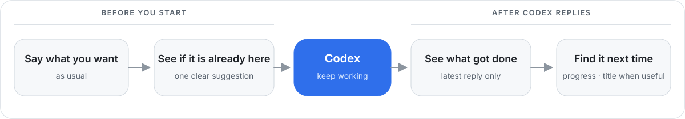

<p align="center">
  
</p>

<h1 align="center">Codex Continuity</h1>

<p align="center"><strong>Continue the right task. Keep the context you already built.</strong></p>

<p align="center">
  A lightweight, local-first Codex plugin that helps you return to the task that already knows the work,<br />
  keep progress recognizable, and choose the right native path when work needs to split.
</p>

<p align="center">
  <a href="./README.zh-CN.md">简体中文</a> ·
  <a href="./LICENSE">MIT License</a> ·
  <a href="./PRIVACY.md">Privacy</a> ·
  <a href="https://github.com/tianwdong/codex-continuity/issues">Issues</a>
</p>

<p align="center">
  
  
  
  
</p>

> [!IMPORTANT]
> Codex Continuity is not another task manager. It does not ask you to maintain another list: tasks stay in Codex, files stay in your project, and Continuity only helps you find where the useful context lives and how the work has moved.

## Install with Codex

Copy this into Codex:

```text
Install the Codex Continuity plugin from this repository:
https://github.com/tianwdong/codex-continuity

Use the repository's Codex Marketplace entry. When installation finishes, tell me when to restart Desktop and guide me through reviewing the plugin Hooks.

After restart, guide me to **Plugins → Installed → Codex Continuity**, then tell me to scroll to **Hooks**, select the gear on the right, and review and trust the Hook definition.
```

After installation, complete this once:

1. Restart Codex or ChatGPT Desktop.
2. Open **Plugins** in the left sidebar, go to **Installed**, and select **Codex Continuity**.
3. Scroll to **Hooks** and select the gear on the far right of that row.
4. Review and trust the Codex Continuity Hook, then start a new task.

The four capability toggles above are separate from Hook review: enabled toggles do not mean the Hook has been trusted. You do not need to remember an install command.

<details>
<summary>Prefer installing it yourself?</summary>

```bash
codex plugin marketplace add tianwdong/codex-continuity
codex plugin add codex-continuity@codex-continuity
```

Restart Desktop, then open **Plugins → Installed → Codex Continuity**, scroll to **Hooks**, select the gear on the right, and review and trust the Hook definition. The repository Marketplace installs only the allowlisted `plugins/codex-continuity/` bundle.

</details>

## Four ways Continuity helps

All four abilities fit into normal conversation; you do not have to keep asking how work should continue. When you state a new goal, Continuity quietly judges whether to stay in the current task, use a subagent, create a branch, or start a separate task. Most requests simply continue. It asks only before changing durable task structure.

### 1. Continue the task that already knows the work · Core

When you start a new task inside a project, Continuity checks whether one existing task already contains the context you need. If there is one clear match, it suggests **Continue the existing task** or **Stay here**. If the answer is uncertain, it stays out of the way.

A copied task link or native cross-task handoff is context for the receiving task, not permission to jump back. Continuity treats the source as untrusted evidence and may read it for context, but it does not resend the prompt, navigate away, or archive either task unless you explicitly ask.

### 2. See what each task has become · Core

Codex can name a task from its first message, but the work may later move somewhere else. After a later goal finishes with a reliable result, Continuity uses the current Codex host to refresh the native title for a clear chapter change—or, when the old workstream would now mislead you, for a proven durable direction change. A local progress marker keeps the change traceable and reversible. You can inspect, undo, lock, or resume automatic title maintenance at any time.

### 3. Quietly decide whether work should stay, branch, or start fresh · Core

For each new durable goal, Continuity reuses the current Codex model for one lightweight semantic judgment instead of adding another LLM Hook. Staying in the current task and low-confidence decisions produce no prompt. A durable branch or separate task gets one lightweight confirmation because it changes long-term structure.

### 4. Recommend or dispatch a suitable subagent · When useful

When work is bounded, independent, and parallel execution would materially improve speed or quality, Continuity offers one short delegation recommendation. With explicit standing authorization for automatic delegation, it may launch the subagent and briefly disclose what it delegated; otherwise it waits for **Run in parallel** or **Do it here**. The main-agent choice remains yours. Profile recommendations may use the latest public [ModelDial Radar](https://modeldial.com/radar) snapshot, without sending your prompt, code, task title, project folder, current configuration, credentials, or telemetry to ModelDial.

## A simple way to organize Codex work

**One stable project folder → several outcome-focused tasks → continue the task that already knows the work.**

- Put work that shares files and background in one stable project folder. An app, website, and backend for the same product can all live under the same project root.
- Create a separate task for each distinct outcome—not for every file, technical layer, or small fix.
- Continue an existing task when the new request depends on context already built there. Start fresh when the outcome can stand on its own.
- Quick, self-contained requests can still start without a project folder. Continuity simply avoids automatic context matching when there is no reliable project boundary.
- No `ROADMAP.md`, labels, manual status fields, or second task system is required.

<details>
<summary>Why keep the project root stable?</summary>

Automatic matching deliberately uses the exact same, non-empty working directory as its project boundary. Opening the repository root one day and a nested `app/` directory the next creates two different boundaries, which reduces match quality. This strict rule prevents unrelated projects with similar language from being mixed together.

This follows the native [Codex project model](https://learn.chatgpt.com/docs/projects): keep long-lived work and shared files in one project, then use a separate task for each distinct outcome.

</details>

## A concrete example

Codex names a task from its first prompt, while real work keeps moving. A task called **“Add Google Analytics”** may eventually become a Cloudflare cost investigation. A week later, the original title no longer tells you which task has the right context.

```text
Native first title          Add Google Analytics
Later working context       Cloudflare cost containment verified
Continuity title            Cloudflare cost | Containment verified
```

Continuity solves this without adding a board, inbox, labels, priorities, or another project database.

## How the three automatic moments work

### Before the first message: look for existing context

Describe your goal naturally. On the first prompt of a genuinely new task, Continuity reviews tasks inside the same project boundary.

- No strong match: your prompt continues normally.
- Ambiguous match: your prompt continues normally.
- One unique, high-confidence match: Continuity suggests either continuing that task or staying here.

It never sends another message, navigates, archives, forks, or merges a task without your choice.

### On each new goal: quietly choose the smallest carrier

The current Codex model classifies a new durable goal as work for the current task, a native subagent, a persistent chat branch, or a separate task.

- Current task: show nothing and do the work.
- Suitable subagent: offer one lightweight recommendation, or launch and briefly disclose it when automatic delegation is already authorized.
- Persistent branch or new task: ask once, then use the native Codex action.
- Low confidence: stay in the current task without interruption.

An explicit **Do it here** immediately overrides any unexecuted automatic suggestion. Returning work to a parent task and archiving remain confirmed durable actions.

### After a completed turn: keep progress recognizable

Codex still owns the initial title. On later durable goals, the current Codex model decides whether completed work has entered a clearly different chapter. When it has, the current host calls the native title tool once before the final reply, so the visible sidebar and the active task use the same connection. A `Stop` Hook then hands a bounded payload to a detached local worker to record one evidence-backed progress statement and provide a conservative persistence fallback.

The workstream stays stable by default. It changes only after an explicit primary-goal shift, or after the previous reliable chapter and current completed turn consistently center a new durable context and the old workstream would mislead future return. Small fixes, repeated conclusions, incomplete work, weak evidence, locked titles, or model failure leave it untouched. Chapter and workstream updates remain reversible.

## Three moments, still no new workflow

<p align="center">
  
</p>

There is no inbox to clear, no board to groom, and no status taxonomy to learn.

## Use it

No command is required for everyday work.

1. Create a task and describe the goal naturally.
2. If Continuity finds one reliable existing context, choose whether to continue it or stay in the new task.
3. State later goals normally. Continuity quietly chooses the smallest carrier and asks only before a durable structure change.
4. Let Codex finish a turn. Continuity records a short local progress marker and updates the title only when the chapter has clearly changed.

You can also ask in natural language:

```text
What did this task most recently accomplish?
Undo the last automatic title change.
Keep this title and stop updating it automatically.
Resume automatic title updates.
```

## How quiet routing works

Continuity does not interrupt ordinary requests with a workflow menu. When a new goal matches its scope, the implicitly invokable router lets the current Codex model choose the smallest native carrier:

| Situation | Recommended native carrier |
| --- | --- |
| Bounded, independent work whose result should return immediately | Subagent |
| Work that inherits the current context but needs a durable conversation | Chat branch |
| Work that does not need the current context | New task |
| Everything else | Stay in the current task |

Current-task and low-confidence decisions stay completely silent. Subagents consume additional tokens, so Continuity recommends them only for bounded independent work where parallel execution materially improves speed or quality. It does not launch one without direct approval or explicit standing authorization. Persistent branches, separate tasks, returns, and archives always require confirmation.

Only a **Subagent** route enters the downstream delegation Skill; it does not run independently on every request. That Skill uses Codex model roles to narrow the model family and may read the latest public [ModelDial Radar](https://modeldial.com/radar) snapshot to select a configuration within that family. It always states the main-agent recommendation as well as the worker recommendation. The plugin does not switch the main agent automatically, and no prompt, code, task title, working directory, current configuration, credentials, or telemetry is sent to ModelDial.

## Compatibility

- macOS or Windows 11
- A recent Codex or ChatGPT Desktop installation
- A working model/provider configuration in Codex

Continuity uses two official moments. `UserPromptSubmit` asks the current Codex model to route later durable goals and, after a verified chapter change, use the current host's native title tool. The compatibility-safe `Stop` Hook records progress and keeps a persistence fallback: its entry returns immediately after launching a detached local worker, so it does not depend on asynchronous Hook support. macOS uses the bundled shell entry; Windows uses the official `commandWindows` override, native PowerShell, and the Desktop-bundled Node/Codex runtime when available. If matching works but titles never update, update Continuity and review the current Hook definition again.

If the plugin is installed but task matching, progress tracking, or title maintenance does not respond, open **Plugins → Installed → Codex Continuity**, select the gear beside **Hooks**, and confirm that the current Hook definition has been reviewed and trusted. The capability toggles above do not replace this step.

## Privacy and control

- **No Continuity backend.** There is no Continuity account and no task-content telemetry.
- **No credential copying.** Semantic decisions reuse the provider and login state already configured in Codex. The plugin does not read API keys, tokens, or the Codex login database.
- **Bounded context.** Title maintenance uses the current title, the previous short progress marker, and a limited slice of the final reply.
- **Same-directory matching.** Automatic matching reviews at most three candidates with the exact same non-empty working directory and at most their two most recent user/final-reply pairs.
- **Small local ledger.** It stores IDs, short chapter/progress text, confidence, title controls, and a single pending cross-task action receipt—not full prompts or conversations. The receipt makes confirmations scoped and structural retries at-most-once.
- **Reversible behavior.** Suggestions never force navigation; automatic renames can be undone, locked, and resumed.

Local state lives in the current user's platform data directory:

| Platform | Path |
| --- | --- |
| macOS | `~/Library/Application Support/Codex Continuity Plugin/` |
| Windows | `%LOCALAPPDATA%\Codex Continuity Plugin\` |
| WSL/Linux | `${XDG_STATE_HOME:-~/.local/state}/codex-continuity-plugin/` |

macOS and Linux use directory mode `0700` and file mode `0600`. Windows uses the current user's `LOCALAPPDATA` access controls. See [PRIVACY.md](./PRIVACY.md) for the complete boundary.

## Native-first architecture

Continuity reuses Codex capabilities instead of recreating a conversation system.

| Moment | Native source of truth | Continuity adds | Failure behavior |
| --- | --- | --- | --- |
| First prompt in a new task | `UserPromptSubmit`, native task list and reads | Review up to three same-directory candidates | Continue the original prompt silently |
| Each later durable goal | `UserPromptSubmit`, router Skill, current Codex model, and native tools | Quietly choose the smallest carrier; after reliable current-task work, refresh only a changed chapter | Stay in the current task and preserve the title |
| A turn completes | Detached `Stop` worker, `turn_id`, final assistant message | Record chapter/progress; preserve title metadata and fallback persistence | Preserve the existing title and progress |
| User requests control | Plugin Skill | Inspect, undo, lock, or resume title maintenance | Make no task change |

The semantic model makes bounded judgments; it does not own task state. Codex App Server remains authoritative for tasks, lineage, reads, and title operations. Uncertain paths fail closed.

## Deliberate boundaries

Continuity intentionally does **not** provide:

- a board, inbox, priorities, due dates, or another project database;
- manual labels or a status-maintenance ritual;
- automatic navigation, archiving, persistent branching, merging, or new-task creation; subagent creation without direct approval or standing auto-delegation authorization;
- cross-directory matching unless the user explicitly requests it;
- modification of the official app bundle or `app.asar`;
- a custom replacement for the native Codex task list.

Current technical limits:

- macOS is verified on a real Desktop installation; the native Windows path has automated contract coverage but still needs a real Windows Desktop acceptance run before its beta label is removed;
- immediate visible title refresh requires the current Codex host's native title tool; if that tool is unavailable, the detached fallback can persist the title but the sidebar may not show it until Codex reloads the task;
- an unfinished background Hook may be cancelled when Codex closes the task;
- the official Plugin UI does not yet expose a stable custom row/action slot in the task sidebar;
- returning from a chat branch means reporting a result back to the parent task, not physically merging conversation histories.

## Develop

```bash
git clone https://github.com/tianwdong/codex-continuity.git
cd codex-continuity
npm start
```

`npm start` validates every Skill and builds the same allowlisted plugin into:

```text
dist/plugin/codex-continuity
plugins/codex-continuity
```

Run the release checks:

```bash
npm run validate:skills
npm test
npm run build:plugin
```

For local development installation on macOS:

```bash
npm run install:plugin:dev -- --wait
```

Then quit Codex/ChatGPT. The installer waits for the main app to exit, rebuilds the plugin, installs it, and verifies the manifest, file list, and SHA-256 of every installed file. Do not write directly into `~/.codex/plugins/cache/`.

## Repository map

- `.codex-plugin/plugin.json` — plugin manifest
- `hooks/hooks.json` — `UserPromptSubmit` and `Stop` lifecycle entries
- `skills/` — context matching, work routing, subagent delegation, and title controls
- `src/plugin-*.mjs` — prompt marker, semantic decisions, progress ledger, and title runtime
- `scripts/build-plugin.sh` — allowlist-based distributable build
- `scripts/run-plugin-node.ps1` — native Windows Hook and title-control launcher
- `plugins/codex-continuity/` — the exact allowlisted bundle installed by the repository Marketplace

## Public documentation

- [Privacy](./PRIVACY.md)
- [Security policy](./SECURITY.md)
- [Contributing](./CONTRIBUTING.md)
- [MIT License](./LICENSE)

## License

Codex Continuity is released under the [MIT License](./LICENSE).
