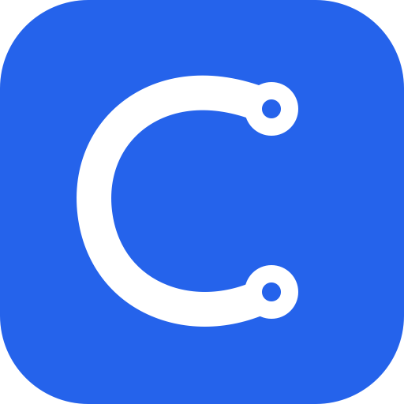

<p align="center">
  
</p>

<h1 align="center">Codex Continuity</h1>

<p align="center"><strong>别再翻一排 Codex 任务，猜这件事该从哪里继续。</strong></p>

<p align="center">
  Continuity 会帮你找到已经有上下文的旧任务，在方向变化时更新标题，<br />
  并在目标变化时判断：直接继续、交给子智能体、开一条支线，还是另开任务。大多数时候，它不会打断你。
</p>

<p align="center">
  <a href="./README.md">English</a> ·
  <a href="./LICENSE">MIT License</a> ·
  <a href="./PRIVACY.md">隐私边界</a> ·
  <a href="https://github.com/tianwdong/codex-continuity/issues">问题反馈</a>
</p>

<p align="center">
  
  
  
  
</p>

> [!IMPORTANT]
> Codex Continuity 不增加看板、收件箱或第二份任务清单。任务仍在 Codex，文件仍在原项目里；它只帮你记住：上下文在哪条任务里，这件事后来做到哪了。

## 让 Codex 帮你安装

把下面这段话发给 Codex，它会自己完成安装：

```text
帮我安装这个 Codex 插件：
https://github.com/tianwdong/codex-continuity

请使用仓库里的 Codex Marketplace。安装好后，告诉我什么时候重启 Desktop，以及在哪里审核并信任 Hook。

重启后，请引导我打开左侧「插件」→「已安装」→「Codex Continuity」，向下滚动到「钩子」，点击右侧齿轮并完成审核与信任。
```

安装完成后只需要做一次：

1. 重启 Codex／ChatGPT Desktop；
2. 打开左侧「插件」，进入「已安装」，选择 **Codex Continuity**；
3. 向下滚动到「钩子」，点击这一行最右侧的齿轮；
4. 审核并信任 Codex Continuity Hook，然后新建一个任务开始使用。

页面上方的 4 个功能开关和下面的 Hook 审核是两回事：开关已经打开，不代表 Hook 已被信任。整个过程不需要记命令。

<details>
<summary>想自己用命令安装？</summary>

```bash
codex plugin marketplace add tianwdong/codex-continuity
codex plugin add codex-continuity@codex-continuity
```

重启 Desktop，然后打开左侧「插件」→「已安装」→ **Codex Continuity**，向下滚动到「钩子」，点击右侧齿轮并完成审核与信任。仓库 Marketplace 只会安装白名单内的 `plugins/codex-continuity/` 插件包。

</details>

## 它解决的不是任务管理，而是「我该从哪条任务继续」

一个项目做久了，左侧往往会堆出十几条任务：网页、App、后端、SEO、临时排查……标题还是最初那句话，真实工作却早已换了方向。你只能一条条点开，看最近回复，才能想起哪条任务掌握了需要的上下文。

Continuity 把这个判断放回 Codex 里，不要求你维护状态。

### 1．新建任务前，先看看是不是已经做过

你照常描述目标。Continuity 只在同一个项目目录里查找旧任务；只有找到一个明确候选时，才问你是「继续旧任务」还是「留在这里」。找不到，或者拿不准，就直接执行你的原请求。

复制任务深度链接，或由 Codex 从另一项任务转发内容，是给当前任务带入上下文，不是授权跳回旧任务。Continuity 会把来源任务当作不可信证据，只在需要时读取背景；它不会把同一句话发回去，也不会擅自跳转或归档。

### 2．让标题跟着真实进展走

Codex 会根据第一句话生成标题，但工作方向可能越走越远。后续目标真正做出可靠结果、而且工作章节明显变化时，Continuity 会通过当前 Codex 直接刷新原生标题，同时在本地留下简短进展和原标题。主标题默认保持稳定；只有用户明确切换长期目标，或连续两个可靠回合已经形成同一个新主线、旧标题会误导下次定位时，才会连同主标题一起更新。自动改名可以查看、撤销、暂停，也可以重新开启。

### 3．新目标来了，先判断应该放在哪里做

普通后续工作直接留在当前任务，不弹菜单。适合并行的小块工作可以交给子智能体；以后还要单独回来继续的工作可以开支线；与当前上下文无关的工作可以另开任务。拿不准时，Continuity 就留在当前任务，不打扰你。

### 4．适合并行时，帮你选一个子智能体

工作有界，而且其中一块可以独立返回、有可信收益时——例如扫描多个文件、独立复核、跨平台对照、分析测试或处理互不重叠的代码——Continuity 就可以主动建议子智能体，不必等到收益已经非常明确，也不要求你先说「并行」或「子智能体」。因为真正派遣前还要由你确认，中等把握就可以提示一次；你选择「就在这里做」后，同一目标不再重复询问。只有已经授权自动委派、判断把握高且职责能够安全隔离时才会直接派遣。共享写入仍留给主任务。主代理是否切换仍由你决定。模型建议可以参考 [ModelDial Radar](https://modeldial.com/radar) 的公开数据，但不会把你的请求、代码、任务标题、项目目录、当前配置或凭据发送给 ModelDial。

插件页的 **Choose a subagent** Skill 开关只代表这项能力可用，不等于自动委派授权。默认情况下，Continuity 仍会先建议并等待选择。如果只想在某个项目内允许合适的自动委派，可以在该项目的 `AGENTS.md` 里直接写：

```md
当任务边界明确、可以独立完成，并且只读或与主任务没有重叠写入时，如果能明显减少等待或保护主任务上下文，可以自动委派一个原生子智能体。共享写入、持久支线、新任务和归档仍需先确认。
```

删掉这条规则，就会恢复为只建议、不自动派遣。

## 怎么用最省心

**一个稳定的项目文件夹，几条按结果划分的任务。**

- 同一个产品的 App、网页端和后端，可以放在同一个项目根目录下。
- 按「这次想做成什么」拆任务，不要因为换了文件或技术层就新建任务。
- 新目标依赖已有背景时，继续原任务；能够独立说明、独立完成时，再开新任务。
- 查天气、改一句话这类临时问题不需要放进项目。没有可靠的项目目录时，Continuity 不会读取或匹配其他任务，也不会自动维护标题；它仍可只根据当前请求和当前上下文静默判断留在这里，或建议原生子智能体。
- 不需要额外维护 `ROADMAP.md`、标签或任务状态。

<details>
<summary>为什么最好一直从同一个项目根目录打开？</summary>

Continuity 会把完全相同的工作目录视为同一个项目。如果今天从仓库根目录打开，明天从里面的 `app/` 子目录打开，它会把两者当成不同项目。这个限制看起来严格，但能避免把名字相似、实际无关的任务混在一起。

这也符合 [Codex 原生项目](https://learn.chatgpt.com/docs/projects)的使用方式：长期工作和共享文件放在同一个项目里，再为每个独立结果建立一条任务。

</details>

## 一个真实会发生的例子

你最初新建任务是为了**「接入 Google Analytics」**，聊着聊着却开始排查 Cloudflare 费用。一周后再回来，左侧仍写着旧标题，你很难知道费用问题的上下文其实藏在这里。

```text
原生初始标题    接入 Google Analytics
后来真实进展    Cloudflare 费用止损已验证
Continuity 标题 Cloudflare 费用｜止损验证
```

Continuity 让标题反映任务现在真正做到哪里，而不是永远停在第一句话。

## 它什么时候会打扰你？

很少。日常请求照常发送，不需要先问「该怎么继续」。

| 发生的情况 | Continuity 怎么做 |
| --- | --- |
| 没找到明确的旧任务 | 同一轮继续判断该留在这里、建议子智能体、开支线还是新建；普通小问题直接执行 |
| 找到唯一、明确的旧任务 | 问一次：继续旧任务，还是留在这里 |
| 新目标适合当前任务，或者拿不准 | 留在当前任务，直接工作 |
| 一小块工作适合并行 | 建议子智能体；已经授权自动委派时可直接派遣并告知 |
| 工作以后需要单独回来继续 | 建议开支线，等你确认 |
| 工作与当前上下文无关 | 建议新建任务，等你确认 |
| 一轮工作结束 | 在本地记录短进展；章节明显变化时通过当前 Codex 刷新标题 |

你明确说「就在这里做」，会立即覆盖尚未执行的建议。开支线、新建任务、回传结果和归档旧任务前，Continuity 都会先征求你的确认。

## 整个过程仍然发生在 Codex 里

<p align="center">
  
</p>

没有需要清空的收件箱，没有需要维护的看板，也没有需要学习的状态分类。

## 日常使用

不用记命令，也不用改变说话方式：

1. 新建任务，照常用自然语言描述目标。
2. 如果 Continuity 找到一个明确的旧任务，选择继续它或留在这里。
3. 后续继续说目标。大多数请求会直接工作，只有开支线或新建任务时需要确认。
4. 一轮结束后，Continuity 会记下做到哪里，并在方向真正变化时维护标题。

需要时，可以直接说：

```text
查看当前任务最近完成了什么。
撤销上次自动改名。
保留这个标题，不要再自动更新。
恢复自动更新标题。
```

## 兼容性

- macOS 或 Windows 11；
- 较新的 Codex 或 ChatGPT Desktop；
- Codex 已经可以正常登录和使用模型。

macOS 主路径已在真实 Desktop 中验证。Windows 11 的 Marketplace 安装、Hook 信任、后台 `Stop` 和自动标题写回也已通过真机验收；首轮旧任务匹配、标题控制命令和子智能体建议仍处于 beta。如果能匹配旧任务、但标题始终不更新，请先更新 Continuity，然后重新审核当前 Hook。

如果插件已经安装，但首次匹配、进展记录或标题维护没有反应，先打开左侧「插件」→「已安装」→ **Codex Continuity**，在「钩子」一栏点击右侧齿轮，确认当前 Hook 定义已经审核并信任。页面上方的功能开关不能代替这一步。

<details>
<summary>查看版本与运行时细节</summary>

Continuity 复用两个官方时机：`UserPromptSubmit` 先检查同项目里可复用的上下文；没有唯一候选时，同一轮继续判断原目标该留在当前任务、建议子智能体、开支线还是新建，后续目标则直接进入这套判断。可靠结果进入新章节时，当前宿主可以调用原生标题工具。兼容型 `Stop` Hook 负责记录进展和持久化兜底。Stop 入口启动本地后台 worker 后立即返回，不依赖 Codex runtime 是否支持异步 Hook。macOS 使用插件自带的 Shell 入口；Windows 使用官方 `commandWindows`、原生 PowerShell，并优先复用 Desktop 内置的 Node／Codex runtime。

</details>

## 隐私与控制

- **没有 Continuity 账号或云端服务：**插件不会把任务内容上传给作者。
- **不碰你的凭据：**它沿用 Codex 已有的模型和登录状态，不读取 API key、Token 或登录数据库。
- **只看需要的内容：**维护标题时，只使用当前标题、上一条短进展和本轮最终回复中的有限内容。
- **只在同一项目里找：**自动匹配最多检查 3 个相同工作目录的候选，每个候选最多查看最近 2 轮用户输入和最终回复。
- **本地只留短记录：**保存任务 ID、简短主题、简短进展、标题控制和最多一条跨任务动作回执，不保存完整请求或整段对话。动作回执用于绑定本次确认，并避免重试时重复发送、新建或归档。
- **可以随时反悔：**建议不会强迫跳转，自动改名可以撤销、暂停和恢复。

本地状态位于当前用户的平台数据目录：

| 平台 | 路径 |
| --- | --- |
| macOS | `~/Library/Application Support/Codex Continuity Plugin/` |
| Windows | `%LOCALAPPDATA%\Codex Continuity Plugin\` |
| WSL／Linux | `${XDG_STATE_HOME:-~/.local/state}/codex-continuity-plugin/` |

macOS 与 Linux 使用目录权限 `0700`、文件权限 `0600`；Windows 使用当前用户 `LOCALAPPDATA` 的访问控制。完整边界见 [PRIVACY.md](./PRIVACY.md)。

## 它怎么做到

Continuity 直接复用 Codex 的任务、模型和原生操作，不另外维护一套会话系统。

| 什么时候 | 使用什么 | Continuity 做什么 | 拿不准时 |
| --- | --- | --- | --- |
| 新任务第一次输入 | `UserPromptSubmit`、原生任务列表、任务读取和路由 Skill | 检查最多 3 个同目录候选；没有唯一候选时继续判断原目标该走哪条路径 | 普通小问题和低置信目标留在当前任务 |
| 你提出后续目标 | `UserPromptSubmit`、路由 Skill、当前 Codex 模型和原生工具 | 判断继续、并行、开支线还是新建；更新已经变化的章节，旧主线已误导定位时才替换主标题 | 留在当前任务并保留标题 |
| 一轮工作完成 | `Stop` 后台 worker、`turn_id` 和最终回复 | 记录短进展、标题元数据和持久化兜底 | 保留现有标题和进展 |
| 你要求查看或撤销 | 插件 Skill | 查看、撤销、暂停或恢复标题维护 | 不改变任务 |

模型只负责判断，不拥有任务状态。任务关系、读取和标题操作仍以 Codex App Server 为准；任何一步拿不准，插件都会保持原状。

## 刻意不做什么

Continuity 有意不提供：

- 看板、收件箱、优先级、截止日期或第二套项目数据库；
- 手工标签和维护任务状态的仪式；
- 未经确认就跳转、归档、开支线、回传结果或新建任务；
- 未经直接授权或已有自动委派授权就创建子智能体；
- 未经用户明确要求的跨目录匹配；
- 对官方 App 或 `app.asar` 的修改；
- 一套取代 Codex 原生任务列表的自定义界面。

当前技术限制：

- Windows 11 的安装、Hook 信任、后台 `Stop` 和自动标题写回已通过真实 Desktop 验收；首轮旧任务匹配、标题控制命令和子智能体建议仍需完整真机验收；
- 即时显示依赖当前 Codex 宿主的原生标题工具；该工具不可用时，后台兜底仍可持久化标题，但侧边栏可能要等 Codex 重新载入任务后才显示；
- Codex 关闭任务时，尚未结束的后台 Hook 可能被取消；
- 官方 Plugin UI 还没有稳定的侧边栏自定义任务行或动作插槽；
- 聊天分支的「回流」是把结果报告给父任务，不是物理合并聊天历史。

## 开发

```bash
git clone https://github.com/tianwdong/codex-continuity.git
cd codex-continuity
npm start
```

`npm start` 会校验全部 Skill，并把同一份白名单插件构建到：

```text
dist/plugin/codex-continuity
plugins/codex-continuity
```

运行发布检查：

```bash
npm run validate:skills
npm test
npm run build:plugin
```

在 macOS 本地开发安装：

```bash
npm run install:plugin:dev -- --wait
```

随后退出 Codex／ChatGPT。安装器会等待主 App 退出、重新构建插件、自动注册当前项目的 `codex-continuity-dev` Marketplace，再安装并核对 manifest、文件清单和每个文件的 SHA-256。无需预先配置 `personal` Marketplace，也不要直接写入 `~/.codex/plugins/cache/`。

## 仓库结构

- `.codex-plugin/plugin.json`：插件清单。
- `hooks/hooks.json`：`UserPromptSubmit` 与 `Stop` 生命周期入口。
- `skills/`：上下文匹配、工作路由、子智能体委派和标题控制。
- `src/plugin-*.mjs`：首轮 marker、语义判断、进展账本与标题运行时。
- `scripts/build-plugin.sh`：基于白名单生成插件产物。
- `scripts/run-plugin-node.ps1`：Windows 原生 Hook 与标题控制启动器。
- `plugins/codex-continuity/`：仓库 Marketplace 实际安装的白名单插件包。

## 公开文档

- [隐私说明](./PRIVACY.md)
- [安全政策](./SECURITY.md)
- [贡献指南](./CONTRIBUTING.md)
- [MIT License](./LICENSE)

## 许可证

Codex Continuity 使用 [MIT License](./LICENSE) 开源。
